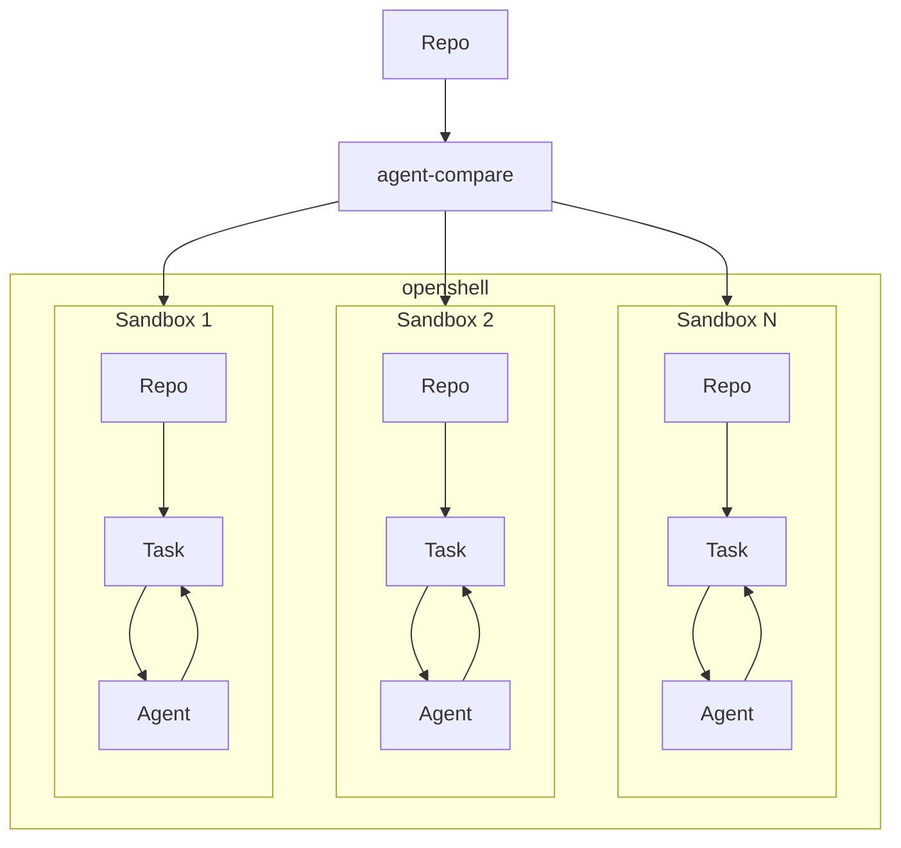

# Agent Compare

Compare coding agents on your task in your project.

- [How It Works](#how-it-works)
- [Setup](#setup)
  - [Docker (Recommended)](#docker-recommended)
  - [Podman](#podman)
- [Usage](#usage)
  - [Providers](#providers)
  - [Playground](#playground)


## How It Works

When you start the playground, you specify which providers you want to compare.
You can choose from any provider available on `openshell`, any of our custom providers, or any of your own providers.

The playground will then spin up a sandbox for each provider, already configured with your agent of choice, and give you commands to connect to each sandbox.

You can then connect to each sandbox and run your task independently, and compare how each performs.



## Setup

### Docker (Recommended)

1. Start the `openshell` gateway

    ```sh
    openshell gateway start
    ```

### Podman

1. Enable rootful podman

    ```sh
    podman machine stop
    podman machine set --rootful=true
    podman machine start
    ```

2. Start the `openshell` gateway

    ```sh
    alias docker="podman"
    openshell gateway start
    ```

3. Update the kube DNS and restart the system

    ```sh
    podman exec openshell-cluster-openshell sh -c 'cp /etc/resolv.conf /etc/rancher/k3s/resolv.conf'
    podman exec openshell-cluster-openshell kubectl -n kube-system rollout restart deployment coredns
    ```

## Usage

### Providers

Configure providers:

```sh
# Using custom providers
agent-compare provider create claude_custom
# Using your own providers
openshell provider create --name my-provider --type claude --from-existing
```

List available custom providers:

```sh
agent-compare provider list
```

List all configured providers:

```sh
openshell provider list
```

### Playground

Start the playground with the current directory:

```sh
agent-compare playground start --providers claude_custom --context .
```

List sandboxes associated with the playground:

```sh
agent-compare playground list
```

Stop all sandboxes associated with the playground:

```sh
agent-compare playground stop
```
